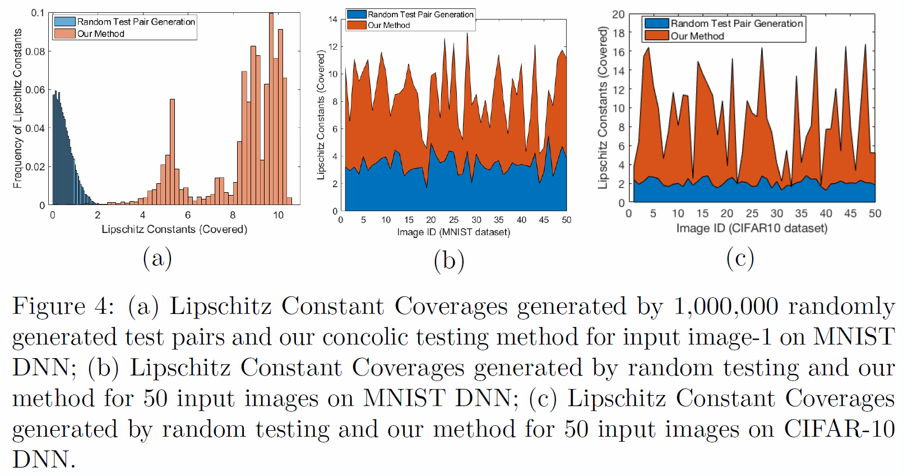

# DeepConcolic (Concolic Testing for Deep Neural Networks)

Youcheng Sun, Min Wu, Wenjie Ruan, Xiaowei Huang, Marta Kwiatkowska, Daniel Kroening.

arXiv:1805.00089 https://arxiv.org/abs/1805.00089

# Abstract
Concolic testing alternates between CONCrete program execution and symbOLIC analysis to explore the execution paths of a software program and to increase code coverage. In this paper, we develop the first concolic testing approach for Deep Neural Networks (DNNs). More specifically, we utilise quantified linear arithmetic over rationals to express test requirements that have been studied in the literature, and then develop a coherent method to perform concolic testing with the aim of better coverage. Our experimental results show the effectiveness of the concolic testing approach in both achieving high coverage and finding adversarial examples.

# Work Flow


# Sample Results




# Run
Two examples:

L-infinity norm/MNIST:
```
python MNIST_nc.py ../../saved_models/mnist_complicated.h5
```

L0 norm/CIFAR10:
```
python CIFAR10_nc.py ../../saved_models/cifar10_complicated.h5
```

# Dependencies
We suggest create an environment using `conda`
```
conda create --name deepconcolic
source activate deepconcolic
conda install keras
```

# Citation

```
@ARTICLE{2018arXiv180500089S,
   author = {{Sun}, Youcheng and {Wu}, Min and {Ruan}, Wenjie and {Huang}, Xiaowei and {Kwiatkowska}, Marta and 
	{Kroening}, Daniel},
    title = "{Concolic Testing for Deep Neural Networks}",
  journal = {ArXiv e-prints},
archivePrefix = "arXiv",
   eprint = {1805.00089},
     year = 2018,
    month = apr,
   adsurl = {http://adsabs.harvard.edu/abs/2018arXiv180500089S}
}
```


# Remark
This tool is under active development and maintenance, please feel free to contact us about any problem encountered.

Best wishes,

youcheng.sun@cs.ox.ac.uk

min.wu@cs.ox.ac.uk

