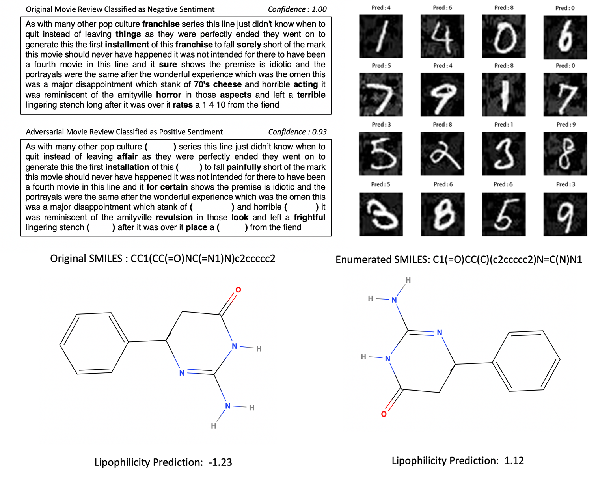

# Coverage-Guided Testing of Long Short-Term Memory (LSTM) Networks: 

## Test Metrics and LSTM Models
       
#### Four Test metrics are used: 
1. Neuron Coverage (NC), 
2. Boundary Coverage (BC), 
3. Step=wise Coverage (SC), 
4. Temporal Coverage (TC)

#### Four models trained by LSTM: 
1. Sentiment Analysis, 
2. MNIST Handwritten Digits, 
3. Lipophilicity Prediction (Physical Chemistry)
4. UCF101 (need to download and put into the dataset file)

## Software Dependencies: 

1. rdkit (https://www.rdkit.org/docs/Install.html), by running the following commands: 

       conda create -c rdkit -n my-rdkit-env rdkit
       
       conda activate my-rdkit-env
       
Note: with the above commands, we create a new virtual environment dedicated for rdkit. Below, every time one needs to run the program, he/she needs to activate the my-rdkit-env
      
2. Other packages including 

       conda install -c menpo opencv keras nltk matplotlib
      
       pip install saxpy sklearn

## Command to Run: 

We have two commands to run testing procedure and to run result analysis procedure, respectively. 

#### to run testing procedure

    python main.py --model <modelName> 
                   --TestCaseNum <Num. of Test Cases> 
                   --threshold_SC <SC threshold> 
                   --threshold_BC <BC threshold> 
                   --symbols_TC <Num. of symbols> 
                   --seq <seq in cells to test>
                   --mode <modeName>
                   --output <output file path>

where 
1. \<modelName> can be in {sentiment, mnist, lipo, ucf101}
2. \<Num. of Test Cases> is expected number of test cases
3. \<Mutation Method> can be in {'random', 'genetic'}
4. \<SC threshold> can be in [0, 1]  
5. \<BC threshold> can be in [0, 1]
6. \<Num. of symbols> can be in {1, 2, 3...}
7. \<seq in cells to test> can be in {mnist: [4, 24], sentiment: [400, 499], lipo: [60, 70], ucf101: [0, 10]}
8. \<modeName> can be in {train, test} with default value test 
9. \<output file path> specifies the path to the output file

For example, we can run the following 

    python main.py --model mnist --TestCaseNum 10000 --threshold_SC 0.6 --threshold_BC 0.8 --symbols_TC 3 --seq [4,24] --output log_folder/record.txt

which says that, we are working with MNIST model, and the test case generation will terminate when the number of test cases is over 10000. We need to specify other parameters including threshold_SC, threshold_BC, symbols_TC, seq. Moreover, the log is generated to the file log_folder/record.txt. 
    
## Reference 

